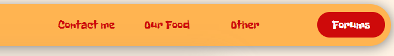
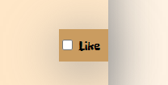
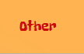

# restaurant_project

Staged website for a restaurant with features such as:
* A save for later page
* Hide or show animations
* fade in and out Animations
* Drop down list Animations
* Forums page
In this project i used HTML CSS and JavaScript

#Contents of readme file:

* contents of website
* Installtion section for VScode and without
* Usage section
* Author
* Terms of use

#Contents of page:

* Main-page : https://markvanderwagen.github.io/restaurant_project/
* Contact Us: https://markvanderwagen.github.io/restaurant_project/contactMe.html
* Save Page: https://markvanderwagen.github.io/restaurant_project/saveToLater.html
* Forums Page: https://markvanderwagen.github.io/restaurant_project/saveToLater.html

#Installation section:

###With out Vs code live server: (some features may not work and you may need to change path names within the code)
1. Download all the files
2. Place them into their own file
3. Open the index.html page within chrome and the page should run

###With Vs code Live server: (first change the path values for your selected folders in the code)
1. Download all the files
2.Place them into their own file
3. In VsCode open the folder you have created for the files
4. download the live server extention for VS code
5. on the bottom right click on the live server button
6. see the magic

#Usage section

* To use this page is like any other page, on the top is the nav bar with the items.

* to save an item like the item you desire then go to the other tab and open readlist, there you will see your item

* You can hide or show an image by clickin on the hide button.

#author

Mark Vanderwagen - https://markvanderwagen.github.io/MyCV/portfolio.html

#Terms of Use

You may use this file but cannot claim it as your own. You are welcome to use code out of this at your own free will, but credit where it is due.

